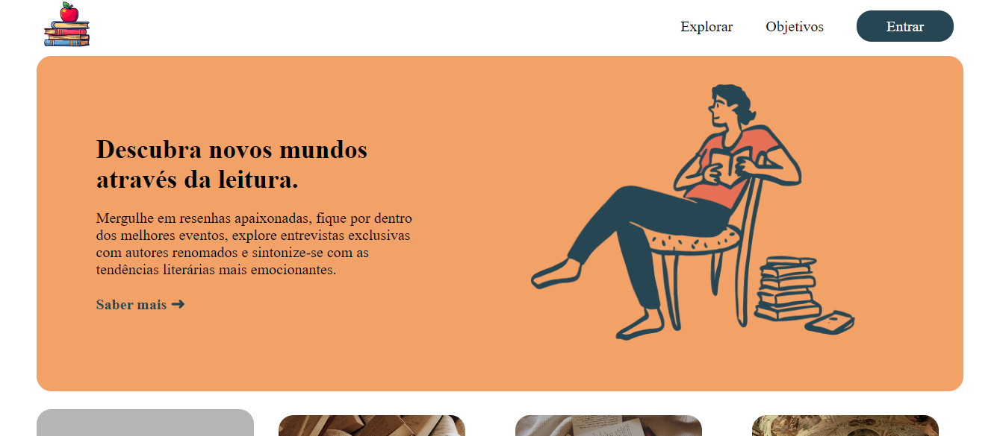

# ProjetoIndividual

 

<h3>Product Backlog</h3>
&rarr; Documentação do projeto  
&rarr; Modelagem de Dados + Script MSQ  
&rarr; Analytics Métricas  
&rarr; API NodeJS  
&rarr; Website (com formulário login/cadastro)  
&rarr; Power Point (para apresentação)  
&rarr; API NodeJS  
** <i>Estar alinhado com Objetivos Sustentáveis da ONU</i>
